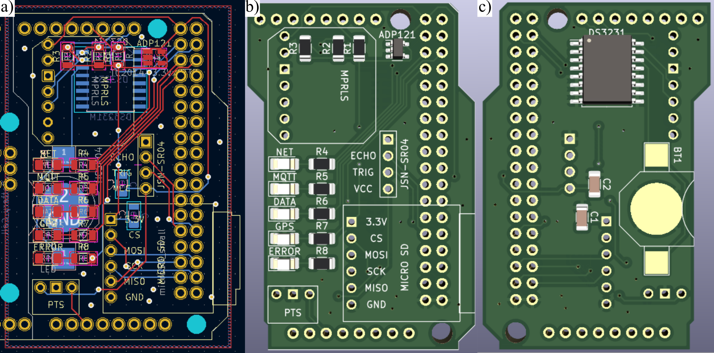

## Overview
1. All PCBs were designed running KiCAD 6.0
2. Custom schematic symbols are located in lib_and_pretty\ARTS-Lab.lib
3. Custom footprint symbols are located in lib_and_pretty\dhec.pretty

## Datalogger PCB
The datalogger PCB is the main data acquisition and saving board. It contains the DS3231 real-time clock, microSD card module, MPRLS ambient pressure sensor, JSN-SR04 ultrasonic sensor, pressure transducer port, and indicator LEDs. 

Figure 1: Datalogger board showing a) the PCB layout and the 3D rendering of the PCB b) front and c) back.

## Power control PCB
The power control PCB is used to monitor the package battery voltage and regulate the voltage to 5V for powering the Arduino Mega. It contains the INA219 current sensor and a barrel battery connector. 

Figure 1: Power control board showing a) the PCB layout and the 3D rendering of the PCB b) front and c) back.

