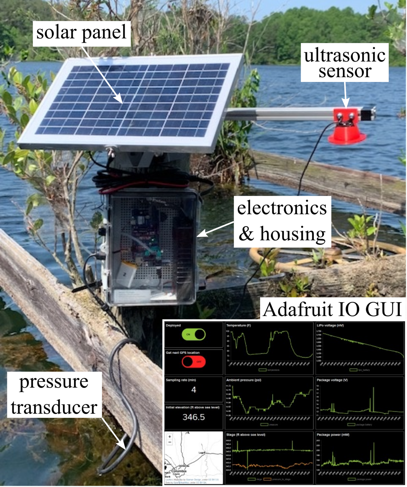

# DHEC-Stage-Sensor
This is an Arduino Mega based stage sensor developed by interns at the South Carolina Department of Health and Environmental Control (SC DHEC) Dam Safety Program. The purpose of this sensor is to provide a low-cost, open-source alternative to traditional gaging equipment. Both an ultrasonic sensor and a pressure transducer are used to measure stage, and all data is sent via the Hologram cellular network to a graphic user interface (GUI) hosted on Adafruit IO.

Figure 1: Sensor deployed on the primary spillway of a dam transmitting data to the GUI.

## characteristic data
contains validation data for the sensor, as well as test data for filtering, pressure transducer calibration

## code
contains all the Arduino code for the sensor

## EDA
contains all electronic design automation (EDA) files for the custom datalogging and power PCBs

## field tests
contains data for all field tests performed with the sensor package, as well as Python scripts for visualizing data

# Citation
Cite as:

@Misc{Smith2022DHECStageSensor,     
  author = {Corinne Smith and Parker Lovett and John McCain and Austin Downey},  
  howpublished = {GitHub},  
  title  = {DHEC Stage Sensor},
  year   = {2022},  
  groups = {{ARTS-L}ab},    
  url    = {https://github.com/ARTS-Laboratory/DHEC-Stage-Sensor},   
}
